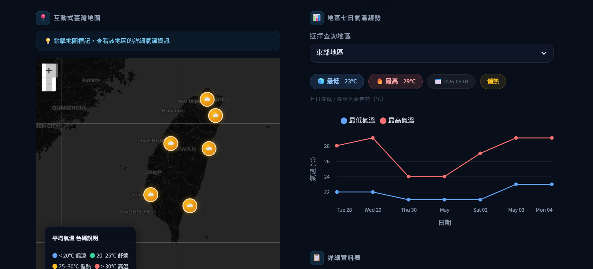

# 臺灣七日天氣預報

這是一個基於 Python 與 Streamlit 開發的互動式全端應用程式，旨在透過中央氣象署 (CWA) 的開放資料 API 自動獲取天氣預報、將資料持久化儲存於 SQLite 資料庫，並透過網頁儀表板展示全台各分區的氣象走勢。

👉 **Live Demo:** [https://weather-forecast-bu6pwpjhfk7lwvtazegdbc.streamlit.app/](https://weather-forecast-bu6pwpjhfk7lwvtazegdbc.streamlit.app/)



---

## 🌟 核心功能特色

### 1. 自動化資料擷取 (`task1_fetch_weather.py`)
- **API 串接**：串接中央氣象署 `F-D0047-091`（鄉鎮預報）開放資料 API。
- **資料解析與聚合**：將原本每 12 小時一筆的原始資料，精確解析並合併為每日的**最低氣溫 (Min)** 與 **最高氣溫 (Max)**。
- **六大區域支援**：涵蓋北部地區、中部地區、南部地區、東北部地區、東部地區、東南部地區。
### 2. 關聯式資料庫儲存 (`task2_store_db.py`)
- **SQLite 整合**：自動建立並維護本地端 `data.db` 資料庫與 `TemperatureForecasts` 資料表。
- **資料清洗與更新**：每次執行皆會清空舊有紀錄並插入最新 42 筆預報資料（6 個地區 × 7 天）。
- **內建驗證機制**：寫入完成後自動執行 `SELECT` 語句驗證資料正確性。

### 3. 互動式視覺化儀表板 (`task3_app.py`)
- **動態 Folium 互動地圖**：提供全台互動地圖，點擊各區標記點可檢視詳細氣溫與彈出視窗。
- **智慧溫層填色**：依據平均氣溫自動對地圖標記套用不同顏色（藍色 <20°C，綠色 20-25°C，黃色 25-30°C，紅色 >30°C）。
- **互動式折線圖**：提供各區域七日最高與最低氣溫走勢圖。
- **全域指標列**：頂部顯示全台六大區域的最新氣溫區間快速總覽。
- **連動資料表**：依照選擇地區自動過濾並顯示詳細的日別氣溫原始數據。

---

## 🛠️ 安裝與執行指南

### 1. 安裝相依套件

請確保您的系統已安裝 Python 3.8+，接著執行：

```bash
pip install -r requirements.txt
```

### 2. 執行流程

本專案分為三個獨立的任務腳本，請**依序**執行以確保資料流正確：

#### 步驟一：測試與擷取 API 資料（選用，僅供確認）
此步驟會請求 CWA API 並在終端機印出格式化的 JSON 原始資料。
```bash
python task1_fetch_weather.py
```

#### 步驟二：更新資料庫（必須）
此步驟會拉取最新天氣資料並寫入至 `data.db`。**若未執行此步驟，App 將沒有資料可顯示。**
```bash
python task2_store_db.py
```

#### 步驟三：啟動 Streamlit 儀表板
啟動前端網頁伺服器，並自動在您的預設瀏覽器中開啟（預設網址為 `http://localhost:8501`）。
```bash
streamlit run task3_app.py
```

---

## 📌 注意事項

1. **API Key**：`task1_fetch_weather.py` 中預設使用專案提供的 API 金鑰。若超過使用配額限制，請至氣象資料開放平臺申請您專屬的授權碼並替換。
---
*Powered by Central Weather Administration (CWA) Open Data & Built with Streamlit, Folium, and Altair.*
